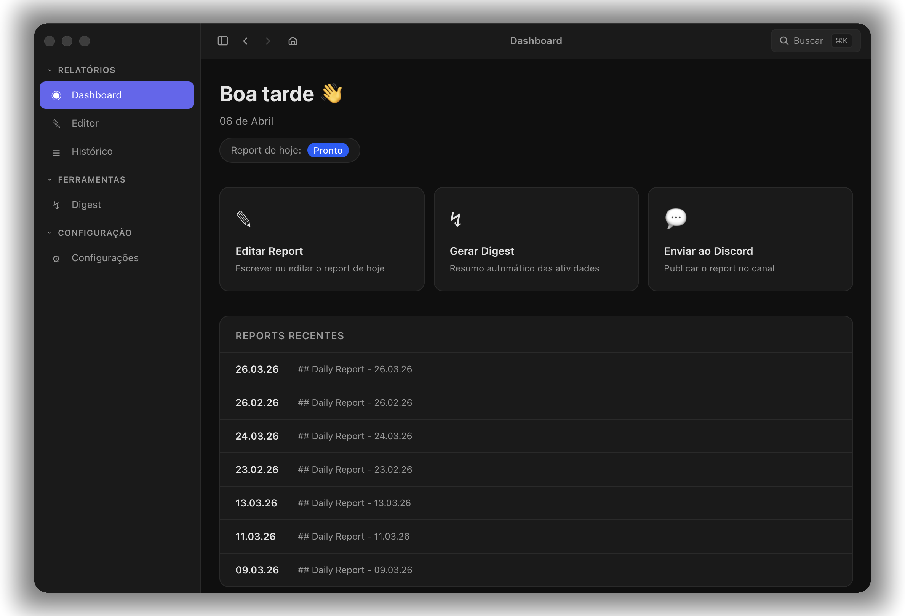
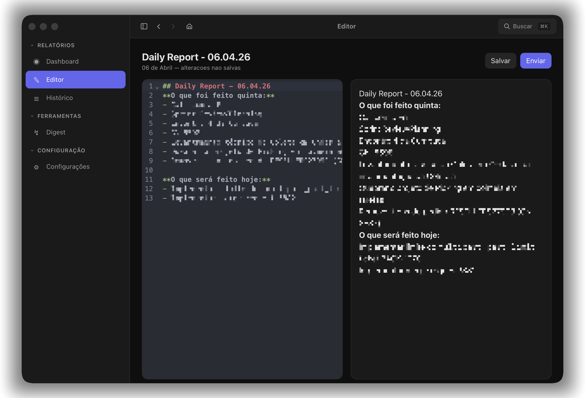
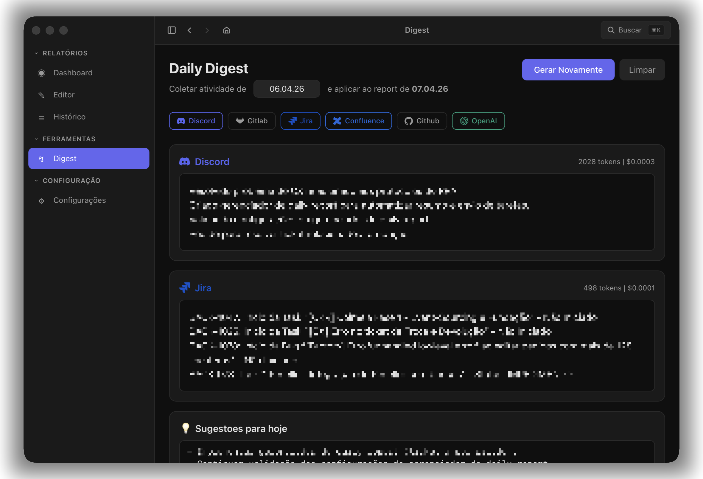
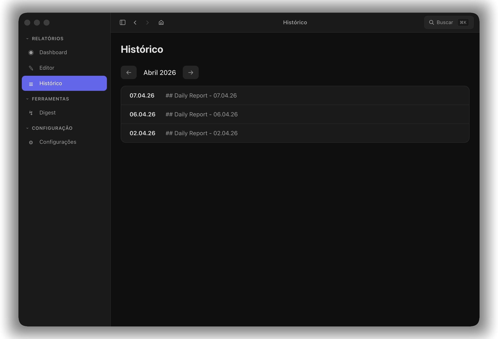
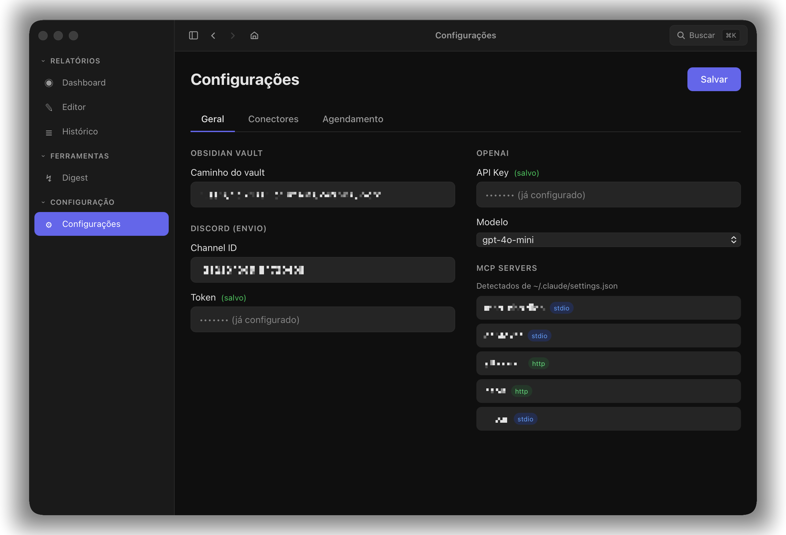
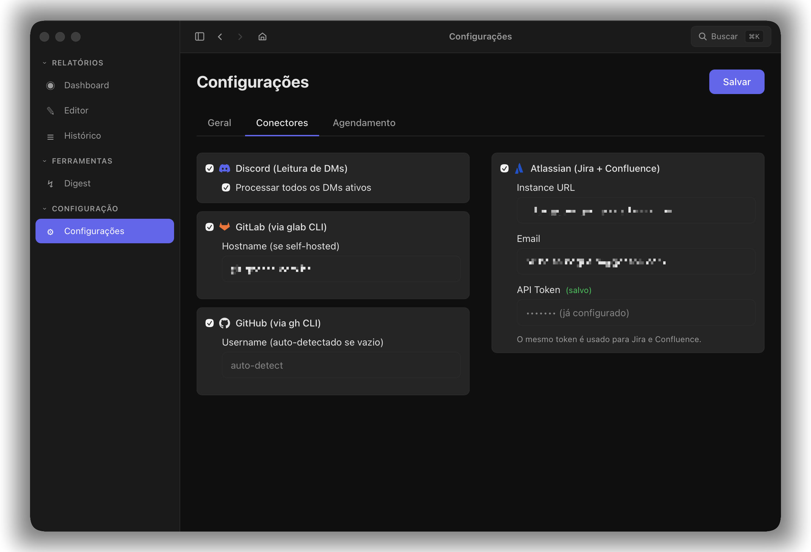
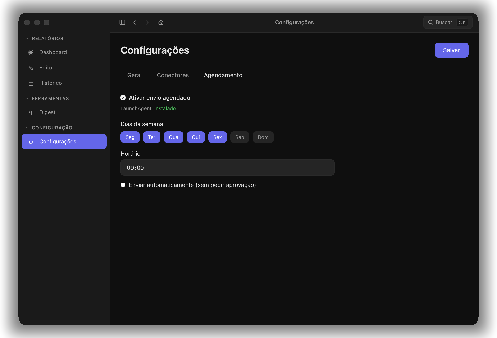

<div align="center">
  
  <h1>Reportly</h1>
  <p><em>Relatórios diários sem atrito — coleta automática, edição em Markdown, envio direto ao Discord.</em></p>
  <p>
    <a href="https://github.com/nicholastn1/reportly/actions/workflows/release.yml"></a>
    <a href="LICENSE"></a>
    
  </p>
</div>

---

## O Problema

Quem trabalha com múltiplas ferramentas — GitLab, GitHub, Jira, Confluence, Discord — sabe como é montar um relatório diário. Abrir cada plataforma, lembrar o que foi feito, copiar links, formatar tudo em texto... é um processo repetitivo que consome tempo e atenção todos os dias.

**Reportly** centraliza esse fluxo em um único app de desktop. Ele coleta automaticamente suas atividades de ontem, gera um resumo com IA, e te dá um editor Markdown para ajustar antes de enviar ao Discord com um clique. Tudo salvo no seu Obsidian vault.

<div align="center">
  
  <br />
  <em>Dashboard — visão geral do dia, ações rápidas e relatórios recentes.</em>
</div>

## Features

### Editor Markdown com Preview ao Vivo

Editor split-pane com CodeMirror (syntax highlighting, tema escuro) à esquerda e preview renderizado à direita. Salve no vault ou envie ao Discord direto do editor.

<div align="center">
  
</div>

### Digest com IA

Coleta atividades de todas as plataformas conectadas e gera um resumo via OpenAI. Mostra tokens utilizados por conector e sugestões para o dia seguinte. Um clique para aplicar ao relatório.

<div align="center">
  
</div>

### Histórico de Relatórios

Navegue pelos relatórios por mês. Veja quais dias têm relatórios e acesse qualquer um para edição.

<div align="center">
  
</div>

### Configurações

Três abas: **Geral** (vault, Discord, OpenAI, MCP servers), **Conectores** (toggle e autenticação por plataforma) e **Agendamento** (dias da semana, horário, modo automático ou com aprovação).

<div align="center">
  
  
</div>
<div align="center">
  
</div>

### Mais

- **Envio para Discord** com um clique (bot token + channel ID)
- **Agendamento automático** via macOS LaunchAgent — o app abre sozinho e envia (ou pede aprovação)
- **Armazenamento no Obsidian Vault** — seus relatórios são arquivos `.md` organizados por ano/mês
- **Command Palette** (`Cmd+K`) para navegação rápida
- **Secrets no macOS Keychain** — API keys nunca ficam em arquivos de configuração

## Conectores Suportados

| Plataforma | Tipo | O que coleta |
|-----------|------|-------------|
| Discord | API (bot token) | Mensagens de DMs ativas |
| GitLab | CLI (`glab`) | Merge requests e atividade |
| GitHub | CLI (`gh`) | Pull requests e atividade |
| Jira | MCP Server | Issues atualizadas |
| Confluence | MCP Server | Páginas criadas/editadas |

> [!TIP]
> Os conectores de GitLab e GitHub usam as CLIs oficiais (`glab` e `gh`), que já devem estar autenticadas no seu terminal. Jira e Confluence usam o MCP Server da Atlassian, detectado automaticamente a partir do `~/.claude/settings.json`.

## Como Funciona

1. **Coleta** — Abra o Digest e clique em "Gerar". O Reportly consulta todos os conectores habilitados e coleta suas atividades do dia anterior.
2. **Resumo** — A OpenAI analisa os dados brutos de cada plataforma e gera um resumo estruturado, além de sugestões para o dia.
3. **Edição** — Revise o conteúdo gerado no editor Markdown. Ajuste o que quiser antes de enviar.
4. **Envio** — Um clique no botão "Enviar" e o relatório é publicado no canal do Discord configurado.

O agendamento pode automatizar os passos 4 (envio automático no horário definido) ou apenas lembrar você com um diálogo de aprovação.

## Instalação

Baixe o `.dmg` mais recente na página de [Releases](https://github.com/nicholastn1/reportly/releases).

> [!NOTE]
> O Reportly é um app Tauri v2 e atualmente suporta apenas **macOS**. Suporte a outros sistemas operacionais não está planejado no momento.

### Requisitos

- macOS 11+
- Obsidian (para armazenamento dos relatórios)
- Discord bot token (para envio)
- OpenAI API key (para digest com IA)

## Desenvolvimento

### Pré-requisitos

- [Node.js](https://nodejs.org/) 18+
- [pnpm](https://pnpm.io/) 10+
- [Rust](https://rustup.rs/) (stable)
- [Tauri CLI](https://tauri.app/) v2

### Setup

```bash
git clone https://github.com/nicholastn1/reportly.git
cd reportly
pnpm install
pnpm tauri dev
```

### Comandos

| Comando | Descrição |
|---------|-----------|
| `pnpm tauri dev` | Dev server (frontend + backend) |
| `pnpm dev` | Dev server (frontend only) |
| `pnpm build` | Type check + build do frontend |
| `pnpm tauri build` | Build de produção (.dmg) |

## Stack

| Camada | Tecnologias |
|--------|-------------|
| Frontend | React 19, TypeScript, Vite 6, Tailwind CSS v4 |
| Editor | CodeMirror 6 (Markdown, One Dark) |
| Backend | Rust, Tauri v2, reqwest, tokio, chrono, serde |
| IA | OpenAI API (via reqwest) |
| Storage | Markdown no Obsidian Vault |
| Secrets | macOS Keychain (security-framework) |
